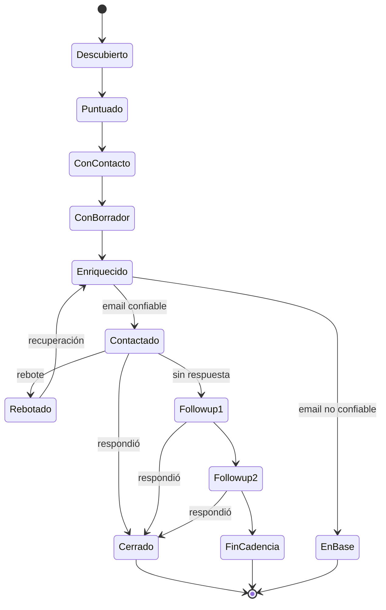

# Flujo del Proceso — Blest Lead Discovery Agent

> Vista de **proceso de negocio** (no de código). Describe el recorrido punta a punta de un lead:
> desde que se define a quién buscar hasta que se responde un correo. Cada etapa indica sus
> **entradas**, su **procesamiento**, sus **salidas** y las **decisiones** que se toman en el medio.

---

## 0. Mapa general (de punta a punta)

```
        ┌──────────────────────────────────────────────────────────────────────────┐
        │                        CONFIGURACIÓN (una vez / on demand)                 │
        │   Perfil de producto: a quién buscar, dónde, con qué tono, qué ofrecer     │
        └──────────────────────────────────────────────────────────────────────────┘
                                          │
            ┌─────────────────────────────┼─────────────────────────────┐
            │ (disparador)                │ (disparador)                │ (disparador)
        ┌───────────┐               ┌───────────┐               ┌──────────────┐
        │ Agenda    │               │ Quick Run │               │ Trigger      │
        │ diaria    │               │ (manual)  │               │ manual web   │
        └───────────┘               └───────────┘               └──────────────┘
            │                            │                            │
            └─────────────┬──────────────┴────────────────────────────┘
                          ▼
   ╔═══════════════════════════════════════════════════════════════════════════════╗
   ║  PIPELINE DE DESCUBRIMIENTO (7 etapas)                                          ║
   ║  1. Descubrir empresas → 2. Puntuar → 3. Buscar contactos → 4. (insights OFF)   ║
   ║  → 5. Generar mensaje → 6. Armar reporte → 7. Persistir                         ║
   ╚═══════════════════════════════════════════════════════════════════════════════╝
                          ▼
                ┌───────────────────┐      DECISIÓN: ¿la empresa ya existía / ya fue
                │ Leads NETO-NUEVOS │ ◄──  contactada? → se descarta (no se re-trabaja)
                └───────────────────┘
                          ▼
   ╔═══════════════════════════════════════════════════════════════════════════════╗
   ║  ENRIQUECIMIENTO DE CONTACTOS (busca el email real)                            ║
   ║  Capa 0 dominio → Capa 1 scraping → Capa 2 patrón+SMTP → Capa 3 Hunter         ║
   ╚═══════════════════════════════════════════════════════════════════════════════╝
                          ▼
                ┌───────────────────┐      DECISIÓN: ¿hay email confiable
                │ Email elegido     │ ◄──  (verificado / publicado / probable)?
                └───────────────────┘
                          ▼
   ╔═══════════════════════════════════════════════════════════════════════════════╗
   ║  ENVÍO (push de borradores a Zoho Mail)                                         ║
   ║  Filtro de elegibilidad → 1 borrador por empresa → marca "contactado"          ║
   ╚═══════════════════════════════════════════════════════════════════════════════╝
                          ▼
   ╔═══════════════════════════════════════════════════════════════════════════════╗
   ║  POST-ENVÍO (loop de seguimiento, lee la casilla)                               ║
   ║  Rebotes → Recuperación │ Respuestas → cierre │ Sin respuesta → follow-up       ║
   ╚═══════════════════════════════════════════════════════════════════════════════╝
```

**Fuente única de verdad:** la base PostgreSQL (en Railway). Todos los disparadores leen y
escriben sobre la misma base; el worker de Windows y la web comparten estado.

---

## 1. Etapa 0 — Configuración del perfil (define el "a quién")

Es el insumo maestro de todo el proceso. Un **perfil** = un producto/servicio con su propio
público objetivo, tono y discurso.

| | Detalle |
|---|---|
| **Entrada** | Decisión humana cargada en el formulario de perfil |
| **Datos** | Industrias objetivo, ciudades, rango de empleados, roles internos a buscar (ej. "Gerente de RR.HH."), tono (cálido / directo / profesional / referido), idioma de salida (es/en), instrucciones de pitch (qué ofrece la empresa, pruebas, qué enfatizar/evitar) |
| **Procesamiento** | Se guarda el perfil; sus valores **sobreescriben** la configuración global cuando están definidos |
| **Salida** | Un perfil activo, listo para alimentar cualquier corrida |
| **Decisión** | ¿El perfil está activo? Solo los activos entran en la agenda |

Perfiles actuales: **Blest Learning** (capacitación de inglés corporativo) y **Blest App**
(SaaS para academias de idiomas). Cada uno apunta a un público y discurso distinto.

---

## 2. Disparadores (cómo arranca una corrida)

Hay **tres formas** de iniciar el mismo pipeline; cambia el contexto, no el motor.

| Disparador | Quién lo lanza | Particularidad de proceso |
|---|---|---|
| **Agenda diaria** | Scheduler (08:00 ART, lun–jue por defecto) | Corre solo, sin intervención. Para alimentar el embudo de forma sostenida |
| **Quick Run** | Persona, desde la web | Descubre **y enriquece en la misma pasada**; pensado para maximizar emails en un solo paso, con revisión humana antes de enviar |
| **Trigger manual** | Persona, con contraseña | Corrida puntual de descubrimiento on demand |

**Decisión de entrada:** ¿qué perfil se corre? Define todo el targeting aguas abajo.

---

## 3. Pipeline de descubrimiento (el corazón)

Cadena de 7 etapas. El criterio de diseño es **volumen de leads con mínimo gasto de IA**:
se usa IA solo donde aporta, el resto es procesamiento de texto/reglas.

### 3.1 Descubrir empresas
- **Entrada:** perfil (industrias, ciudades, tamaño, términos de foco).
- **Procesamiento:** se generan consultas de búsqueda → se buscan en la web → se extraen empresas candidatas de los resultados.
- **Salida:** lista de empresas candidatas con datos estructurados (nombre, dominio si aparece, tamaño, señales).
- **Decisiones en el medio:**
  - **Dedup dentro de la corrida** (misma empresa con distinto nombre se unifica).
  - **¿La empresa ya está en la base?** Si ya se conoce → se descarta (regla "leads neto-nuevos").
  - **¿Ya tiene estado de contacto?** Si ya fue contactada → siempre se excluye.
  - Resultado neto: cada corrida saca empresas **nuevas**, no repite las anteriores.

### 3.2 Puntuar oportunidades (sin IA)
- **Entrada:** empresas candidatas con sus campos estructurados.
- **Procesamiento:** scoring por reglas en Python, 0–100, sumando señales:
  tamaño de empresa, exposición internacional, fuerza remota, actividad de contratación
  en inglés, industria/adopción tecnológica, keywords de inglés.
- **Salida:** score + prioridad por empresa.
- **Decisión:** clasificación por umbral →
  **`quick_win` (≥70)** · **`strategic` (≥40)** · **`low_priority` (<40)**.
  La prioridad ordena a quién se le dedica esfuerzo después.

### 3.3 Buscar contactos
- **Entrada:** empresas priorizadas + roles objetivo del perfil.
- **Procesamiento:** se buscan **personas con nombre** que ocupen esos roles (decisores).
- **Salida:** contactos con nombre, rol y (si aparece) LinkedIn.
- **Decisión:** un contacto **sin nombre** (solo rol/genérico) se descarta al persistir —
  no se le puede escribir ni adivinar el email.

### 3.4 Insights — **desactivado**
- Etapa presente en el flujo pero **no hace nada** (decisión de costo: 0 llamadas de IA).
  Se mantiene en la cadena por compatibilidad. Salida = vacío.

### 3.5 Generar mensaje de acercamiento (outreach)
- **Entrada:** datos de la empresa + instrucciones de pitch del perfil + idioma/tono.
- **Procesamiento:** un borrador de email por empresa, con **reglas de veracidad estrictas**:
  - Solo se mencionan hechos presentes en los datos de la empresa.
  - Nunca se afirma que la empresa "no tiene / le falta" algo (una ausencia no es verificable).
  - Si los datos son pobres, se abre con una observación verdadera de industria/rol en vez de inventar.
- **Salida:** asunto + cuerpo del email (borrador), en el idioma del perfil (español voseo o inglés).
- **Decisión:** la forma del mensaje (gancho → puente de valor → prueba opcional → 1 CTA de baja
  fricción). Enfoque "ganarse la respuesta, no vender".

### 3.6 Armar reporte
- Consolida todo lo anterior en un reporte de la corrida (sin IA).

### 3.7 Persistir
- **Entrada:** empresas, oportunidades, contactos, reporte.
- **Procesamiento / Decisiones de deduplicación:**
  - **Empresa:** 1 fila por negocio real → match por dominio, luego por nombre exacto, luego por nombre normalizado (saca SA/SRL/Inc, puntuación). Evita que el feedback se parta entre duplicados.
  - **Contacto:** dedup dentro de la empresa por LinkedIn, luego por nombre; si ya existe se rellenan campos faltantes en vez de duplicar.
- **Salida:** estado persistido en la base = la corrida ya es consultable y accionable.

---

## 4. Enriquecimiento de contactos (encontrar el email real)

Es la etapa que convierte "un nombre" en "una dirección a la que escribir". Corre en Quick Run
(automático tras descubrir), por botón en la web, o por el worker.

**Decisión de arranque:** ¿el contacto tiene nombre? Sin nombre, no entra (no hay forma de
buscar/inferir su email).

### Capa 0 — Resolver dominio
- **Decisión:** ¿la empresa tiene dominio? (~la mitad no lo trae). Sin dominio, el resto falla.
- **Procesamiento:** se intenta derivar de un email existente, o buscar el sitio oficial
  (rechazando redes sociales / portales de empleo / directorios).
- **Salida:** dominio resuelto, guardado en la empresa (salvo que otra empresa ya lo tenga).

### Capa 1 — Scraping del sitio
- **Procesamiento:** descarga páginas típicas (home, contacto, nosotros, equipo, about), extrae emails y teléfonos/WhatsApp.
- **Decisiones:**
  - ¿Hay un email que **coincide con el nombre** de la persona? → se toma como **verificado** (la mejor salida).
  - ¿Hay buzones genéricos publicados (`info@`, `contacto@`, `ventas@`…)? → se **guardan en reserva** (son reales y entregables) pero solo se usan si no aparece un email nominal verificado.

### Capa 2 — Patrón + verificación SMTP
- **Procesamiento:** genera permutaciones (`nombre.apellido@`, `napellido@`, etc.); si la Capa 1 encontró emails, infiere el patrón corporativo y lo prioriza; verifica candidatos con el proveedor configurado.
- **Decisiones por resultado:** `valid` → **verificado** (se corta acá) · `catch_all` → **probable** · `invalid`/dominio muerto → se descarta.
- **⚠ Riesgo de proceso:** un verificador pago **sin créditos** devuelve `unknown` → el sistema guarda la conjetura como **probable** y el envío igual la empuja → **rebote**. Regla operativa: mantener el verificador con saldo.

### Capa 3 — Hunter.io (fallback)
- **Decisión por score:** ≥90 → **verificado** · ≥50 → **probable**.

### Decisión final — qué email gana (precedencia)
1. **Email nominal verificado** (coincidencia de nombre, SMTP válido, o Hunter ≥90).
2. **Buzón genérico publicado** (`info@`/`contacto@` real del sitio) — gana sobre cualquier conjetura porque no rebota.
3. **Conjetura de patrón no verificada / catch_all (probable)** — solo si no hay genérico. Es el camino propenso a rebotes.

- **Salida:** el contacto queda con `email_status` ∈ {verified, probable, not_found} y la fuente del email.

---

## 5. Envío — push de borradores a Zoho Mail

Convierte borradores en correos listos en la casilla (carpeta Drafts). No envía automáticamente;
deja el draft para revisión/disparo.

| | Detalle |
|---|---|
| **Entrada** | Oportunidades con borrador + contacto con email |
| **Filtro de elegibilidad (decisiones)** | Solo emails **verified/probable** · empresa **no** contactada antes (sin `ContactStatus`) · oportunidad **no** empujada antes (`zoho_pushed_at` vacío) · **1 contacto por empresa** por lote |
| **Procesamiento** | Crea 1 borrador por empresa en Zoho; si la oportunidad no tiene borrador, lo genera en el momento |
| **Salida** | Borrador en Zoho + se marca `zoho_pushed_at` y la empresa como "contactada" (idempotencia: no se re-empuja) |
| **Decisión clave** | Garantiza que **una empresa nunca recibe outreach duplicado** entre corridas |

Modos de push: todos los elegibles, seleccionados manualmente, o uno por uno (Quick Run / web).

---

## 6. Post-envío — loop de seguimiento (lee la casilla)

Acá el proceso deja de "salir a buscar" y empieza a "escuchar y reaccionar". El worker corre
estas fases en orden; también hay equivalentes manuales en la web/CLI.

### 6.1 Detección de rebotes
- **Entrada:** bandeja de entrada de Zoho.
- **Procesamiento:** busca notificaciones de rebote (de mailer-daemon/postmaster; asuntos tipo "Undelivered"/"Undeliverable"; ignora avisos de "delay"), extrae las direcciones que fallaron y las cruza con los contactos.
- **Decisión / Salida:** match → `email_status = "bounced"` → el contacto **sale** de la elegibilidad de envío.

### 6.2 Recuperación de rebotados
- **Entrada:** contactos `bounced`.
- **Procesamiento:** el rebote prueba que la conjetura anterior estaba mal → se **bloquea** esa dirección (lista negra) y se **re-enriquece** buscando otra (las capas saltean las direcciones bloqueadas).
- **Salida:** un email alternativo (idealmente mejor); se reintenta el envío en la misma corrida.
- **⚠ Decisión condicionada:** confirmar la alternativa requiere verificador **con saldo**; con 0 créditos solo produce otra conjetura.

### 6.3 Detección de respuestas
- **Entrada:** stubs de la bandeja (sin abrir cuerpos).
- **Decisiones:**
  - ¿Llegó un correo de la dirección de un contacto **después** del push del primer toque? → se marca `replied_at` (respondió). Mail previo no cuenta.
  - ¿Es un **auto-reply de "fuera de oficina" (OOO)**? → no cuenta como respuesta, pero **confirma entrega** (sube el email a verificado) y **reinicia el reloj** de cadencia para no escribir mientras la persona está ausente.
- **Salida:** contactos/empresas que respondieron quedan **excluidos** de follow-ups y se reflejan en el reporte de contactados.

### 6.4 Follow-ups (seguimiento a quien no respondió)
- **Entrada:** oportunidades empujadas, sin respuesta ni feedback manual, con email confiable y no respondido.
- **Cadencia (decisiones de timing):**
  - Toque 1: ~4 días después del push (o después del OOO si es más tarde).
  - Toque 2: ~6 días después del toque 1.
  - Máximo **2** follow-ups.
- **Procesamiento:** genera un borrador "Re: …" (referencia el original, 1 CTA, idioma del perfil) y lo empuja a Zoho; bumpea el contador de follow-ups.
- **Salidas / ramificaciones:**
  - **"Hacer hoy"** (bring-forward): adelantar un follow-up salteando la espera, si la empresa sigue elegible.
  - **"Reactivar":** si una respuesta fue un falso positivo (ej. un OOO), se limpia `replied_at` y la empresa **re-entra** a la cadencia.

---

## 7. Cuadro de decisiones (resumen)

Columna **Quién decide**: `🧠 IA` = decisión de juicio tomada por un modelo · `⚙️ Reglas` =
lógica determinística (umbrales/condiciones) · `🌐 API ext.` = veredicto de un servicio externo
(verificador SMTP / Hunter / casilla de Zoho) · `👤 Humano` = decisión de la persona.

| # | Punto de decisión | Opciones | Quién decide | Efecto |
|---|---|---|---|---|
| D1 | ¿Perfil activo? | sí / no | 👤 Humano + ⚙️ Reglas | Entra o no a la agenda |
| D2 | ¿Empresa ya conocida / contactada? | sí / no | ⚙️ Reglas | Se descarta (leads neto-nuevos) |
| D3 | Score de la empresa | ≥70 / ≥40 / <40 | ⚙️ Reglas | quick_win / strategic / low_priority |
| D4 | ¿Contacto con nombre? | sí / no | ⚙️ Reglas | Sin nombre se descarta |
| D5 | ¿Empresa tiene dominio? | sí / resolver / no | ⚙️ Reglas + 🌐 búsqueda web | Define si el enriquecimiento puede seguir |
| D6 | Email encontrado | nominal verif. / genérico / conjetura / nada | ⚙️ Reglas (precedencia) | Qué dirección se usa |
| D7 | ¿Email confiable? | verified / probable / not_found | 🌐 API ext. → ⚙️ Reglas | Elegible o no para envío |
| D8 | ¿Ya contactada/empujada? | sí / no | ⚙️ Reglas | Evita outreach duplicado |
| D9 | ¿Llegó correo a la casilla? | rebote / respuesta / OOO / nada | 🌐 casilla + ⚙️ Reglas (asunto/fecha) | Recuperar / cerrar / pausar / seguir |
| D10 | ¿Cuántos follow-ups van? | 0 / 1 / 2 | ⚙️ Reglas (cadencia) | Define próximo toque o fin de cadencia |

> **Observación clave de proceso:** **ninguna de las decisiones de bifurcación (D1–D10) la toma
> la IA.** Todos los "gates" del flujo son por reglas, umbrales o veredictos de APIs externas. La
> IA no decide a quién contactar ni si un lead avanza — eso lo hace lógica determinística.

---

## 7-bis. Dónde decide la IA (vs. reglas)

La IA **no actúa como portero del flujo**; actúa como **generador y extractor** dentro de algunas
etapas. Son decisiones de *contenido/selección*, siempre acotadas por reglas posteriores.

| Etapa | ¿Usa IA? | Modelo | Qué "decide" la IA | Qué la acota después |
|---|---|---|---|---|
| Generar consultas de búsqueda | 🧠 **Sí** | Haiku | Qué términos/ángulos de búsqueda generar a partir del perfil | Las consultas solo alimentan la búsqueda web |
| Extraer empresas de resultados | 🧠 **Sí** | Haiku | Qué empresas candidatas reconocer en el texto de resultados | Dedup + filtro "neto-nuevos" (D2) por reglas |
| Puntuar oportunidades | ⚙️ No | — | (Score 100% por reglas, sin IA) | — |
| Buscar contactos | 🧠 **Sí** | Haiku | Qué personas con nombre/rol son decisores según los `target_roles` | Se descartan sin-nombre (D4) por reglas |
| Insights | ⏸ Desactivado | — | (No corre) | — |
| Redactar outreach | 🧠 **Sí** | Outreach (Sonnet por defecto) | El ángulo/gancho y la redacción del email | **Reglas de veracidad** + forma fija del mensaje |
| Armar reporte / Persistir | ⚙️ No | — | (Sin IA) | — |
| Enriquecimiento (capas 0–3) | ⚙️ No | — | Scraping, patrones, SMTP y Hunter son reglas/APIs, **sin IA** | Precedencia de email (D6) por reglas |
| Detección rebote/respuesta/OOO | ⚙️ No | — | Match por remitente/asunto/fecha, **sin IA** | — |
| Redactar follow-up | 🧠 **Sí** | Outreach (Sonnet) / Haiku | La redacción del "Re:" | Cadencia (D10) y elegibilidad por reglas |

**Lectura de automatización:** la IA toca **4 puntos** del flujo (generar consultas, extraer
empresas, identificar contactos, redactar mensajes). Todo lo demás —incluyendo **todas las
decisiones de avanzar/descartar y el email**— es determinístico. Esto es deliberado: contiene el
costo de IA (~$0.12 por corrida) y mantiene predecible el comportamiento del embudo.

---

## 8. Flujo de datos (entrada → procesamiento → salida)

```
Perfil (humano)
   └─► Consultas de búsqueda ─► Web ─► Empresas candidatas
                                          └─► Scoring (reglas) ─► Empresas priorizadas
                                                 └─► Contactos (nombre+rol)
                                                        └─► Borrador de email (IA, veraz)
                                                               └─► PERSISTIR (dedup empresa+contacto)
                                                                      └─► Enriquecimiento ─► email + estado
                                                                             └─► Push Zoho (elegibles) ─► Borrador en casilla
                                                                                    └─► marca "contactado" / zoho_pushed_at
Bandeja Zoho (externo)
   ├─► Rebote  ─► email_status=bounced ─► Recuperación (re-enriquecer)
   ├─► Respuesta ─► replied_at ─► cierre (sale de follow-up)
   └─► OOO ─► confirma entrega + reinicia reloj de cadencia
                                                                             └─► Follow-up (≤2 toques) ─► Borrador "Re:" en casilla
```

---

## 9. Estados clave de un lead (ciclo de vida)

```
DESCUBIERTO ─► PUNTUADO ─► CON CONTACTO ─► CON BORRADOR ─► ENRIQUECIDO
   ─► (email confiable?) ──no──► queda en base, no se envía
                          └─sí─► EMPUJADO/CONTACTADO
                                     ├─► REBOTÓ ─► (recuperación) ─► re-enriquecido ─► reintento
                                     ├─► RESPONDIÓ ─► CERRADO (fuera de cadencia)
                                     └─► SIN RESPUESTA ─► FOLLOW-UP 1 ─► FOLLOW-UP 2 ─► fin de cadencia
```

---

## 10. Versión visual (diagramas)

> Estos diagramas se **renderizan automáticamente en GitHub** (formato Mermaid).
> Código de color: 🟦 **IA** · ⬜ **Reglas** · 🟨 **API/servicio externo** · 🟩 **Humano** · 🟥 **estado de salida**.

### 10.1 Flujo de punta a punta

```mermaid
flowchart TD
    subgraph CONFIG[" "]
        P["👤 Perfil de producto<br/>quién, dónde, tono, qué ofrece"]:::human
    end

    P --> TRIG{"Disparador"}:::rule
    TRIG -->|Agenda diaria| PIPE
    TRIG -->|Quick Run| PIPE
    TRIG -->|Trigger manual| PIPE

    subgraph PIPE["PIPELINE DE DESCUBRIMIENTO"]
        direction TB
        Q["🧠 Generar consultas"]:::ai --> W["🌐 Búsqueda web"]:::ext
        W --> EX["🧠 Extraer empresas"]:::ai
        EX --> D2{"¿Ya conocida<br/>o contactada?"}:::rule
        D2 -->|Sí| DROP["🟥 Descartada"]:::out
        D2 -->|No| SC["⚙️ Puntuar (reglas)"]:::rule
        SC --> D3{"Score"}:::rule
        D3 -->|≥70| QW["quick_win"]:::rule
        D3 -->|≥40| ST["strategic"]:::rule
        D3 -->|<40| LP["low_priority"]:::rule
        QW --> CT
        ST --> CT
        LP --> CT
        CT["🧠 Buscar contactos"]:::ai --> D4{"¿Con nombre?"}:::rule
        D4 -->|No| DROP2["🟥 Descartado"]:::out
        D4 -->|Sí| OUT["🧠 Redactar outreach<br/>(reglas de veracidad)"]:::ai
        OUT --> PER["⚙️ Persistir + dedup"]:::rule
    end

    PER --> ENR

    subgraph ENR["ENRIQUECIMIENTO (sin IA)"]
        direction TB
        D5{"¿Tiene dominio?"}:::rule -->|No| RES["🌐 Resolver dominio"]:::ext
        D5 -->|Sí| L1
        RES --> L1["⚙️ Capa1 scraping"]:::rule
        L1 --> L2["🌐 Capa2 patrón + SMTP"]:::ext
        L2 --> L3["🌐 Capa3 Hunter"]:::ext
        L3 --> D6{"Email que gana<br/>(precedencia)"}:::rule
    end

    D6 --> D7{"¿Email confiable?<br/>verified/probable"}:::rule
    D7 -->|No| HOLD["🟥 Queda en base,<br/>no se envía"]:::out
    D7 -->|Sí| D8{"¿Ya contactada<br/>o empujada?"}:::rule
    D8 -->|Sí| SKIP["🟥 Se saltea<br/>(no duplica)"]:::out
    D8 -->|No| PUSH["🌐 Push borrador a Zoho<br/>marca contactado"]:::ext

    PUSH --> POST

    subgraph POST["POST-ENVÍO (lee la casilla)"]
        direction TB
        D9{"¿Llegó correo<br/>a la casilla?"}:::ext
        D9 -->|Rebote| REC["⚙️ Recuperación<br/>blocklist + re-enriquecer"]:::rule
        D9 -->|Respuesta| CLOSE["🟥 Cerrado<br/>(fuera de cadencia)"]:::out
        D9 -->|OOO| OOO["⚙️ Confirma entrega<br/>+ reinicia reloj"]:::rule
        D9 -->|Nada| D10{"¿Follow-ups?"}:::rule
        D10 -->|0 → 1 → 2| FUP["🧠 Redactar follow-up<br/>+ push Re:"]:::ai
        D10 -->|"= 2"| END["🟥 Fin de cadencia"]:::out
    end

    REC -.re-enriquecer.-> ENR
    OOO -.reinicia.-> D10
    FUP -.próximo toque.-> D9

    classDef ai fill:#1f6feb,stroke:#0d2a66,color:#fff;
    classDef rule fill:#f6f8fa,stroke:#57606a,color:#24292f;
    classDef ext fill:#fff8c5,stroke:#9a6700,color:#24292f;
    classDef human fill:#dafbe1,stroke:#1a7f37,color:#24292f;
    classDef out fill:#ffebe9,stroke:#cf222e,color:#24292f;
```



### 10.2 Dónde decide la IA (mapa de calor del flujo)


🟦 = IA (Haiku/Sonnet) · ⬜ = Reglas · 🟨 = API externa.
**La IA aparece en 4 cajas (generar consultas, extraer empresas, buscar contactos, redactar
mensajes). Las decisiones de avanzar/descartar y el email nunca son IA.**

### 10.3 Ciclo de vida de un lead (estados)



---

### Notas de proceso (no de código)

- **Regla rectora:** el sistema está afinado para **volumen de leads a bajo costo de IA**; por eso varias etapas son por reglas y la IA se reserva para descubrir, buscar contactos y redactar.
- **Anti-duplicación en 3 niveles:** dentro de la corrida, entre corridas (leads neto-nuevos) y al enviar (1 outreach por empresa de por vida).
- **El cuello de botella de calidad es el email:** la precedencia de direcciones y el estado del verificador (con/sin saldo) determinan cuántos correos rebotan.
- **El loop post-envío es reactivo:** depende de leer la casilla de Zoho; sin los permisos de lectura, rebotes/respuestas/follow-ups no operan.
